## Contents

0. [Структура исходного кода](#структура-исходного-кода)
1. [Class Library](#class-library)
2. [Пользование программой](#пользование-программой)
3. [Примеры работы программы:](#примеры-работы-программы)
   3.1. [a - add_new_book](#a---add_new_book)
   3.2. [f - find_book](#f---find_book)
   3.3. [c - change_book_status](#c---change_book_status)
   3.4. [d - delete_book](#d---delete_book)
   3.5. [s - show_all](#s---show_all)
4. [Прочее](#прочее)

## Структура исходного кода

От 1 до 236 строки включительно идёт описание класса Library, который напрямую взаимодействует с файлом, хранящим данные библиотеки. \
Далее, с 238 до 269 строки идут три вспомогательные функции, которые ожидают пользовательский ввод и обрабатывают его. \
Наконец, с 274 до 297 строки описано тело программы, которое отображает пользователю интерфейс программы.

## Class Library

Класс Library включает в себя 10 методов, 5 из которых основные для работы с файлом библиотеки: \
    - `add_new_book()` - добавить запись о новой книге; \
    - `change_book_status()` - изменить статус книги из библиотеки; \
    - `delete_book()` - удалить из библиотеки запись о книге; \
    - `find_book()` - найти нужную книгу в библиотеки по названию, автору или году издания; \
    - и `show_all()` - показать все книги, хранящиеся в библиотеке.

Остальные 5 методов являются вспомогательными и их функция - исключить дублирование кода в основных пяти: \
    - `print_out_record_info()` - вывод результатов поиска, добавления, удаления, изменения; \
    - `ordering_id()` - обновляет индексы книг в библиотеке и возврващает максимальные `id`, длину названия книги и имя автора; \
    - `extract_title_author_year()` - извлекает из строки записи название книги, её автора и года издания для метода `find_book`; \
    - `readlines_from_file()` - выкачивание всех записей из файла библиотеки в локальную переменную; \
    - `check_correct_id()` - проверка вводимого пользователем `id`.

## Пользование программой

__Ввод всех команд работает только с нажатием Enter после них!__ \
__Но есть и плюсы - команды внутри программы засчитываются в любом регистре и на обоих языках.__

Для запуска программы достаточно находиться в директории с файлом исходного кода и:
- ввести в терминал команду: `python3 lib.py`;
- или ввести `make`, после чего окно терминала очиститься и выйдет главное меню программы.

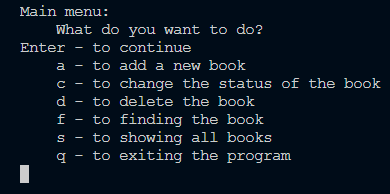 \
Окно главного меню программы.

Все команды имеют краткое описание. Чтобы их использовать, достаточно следовать инструкциям. \
Так, чтобы добавить запись, нажимаем `a`, потом `Enter` и получаем следующее окно, в которое так же, последовательно, вводим данные о книге:

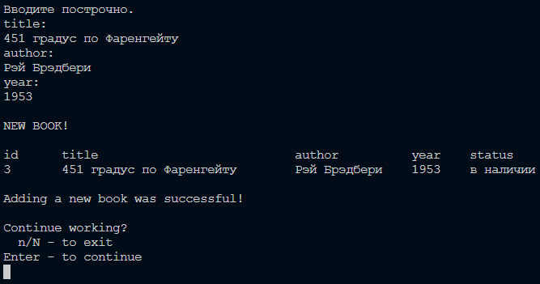 \
Добавление новой книги.

После каждого действия из основного меню выходит дополнительное меню, которое уточняет, нужно ли выйти из программы или надо продолжить работу:

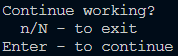 \
Вывод дополнительного меню.

Нажав _n_ или _N_ в дополнительном меню и подтвердив его Enter'ом, можно выйти из программы. \
Нажав только _Enter_, можно вернуться в основное меню и повторить любое действие.

## Примеры работы программы:

- ### a - add_new_book():

  Ещё пара примеров работы программы:

  Пропуская ввод названия, автора или года издания книги при её добавлении в библиотеку, им присваиваются значения по умолчанию - `unknown` и `2024`:

  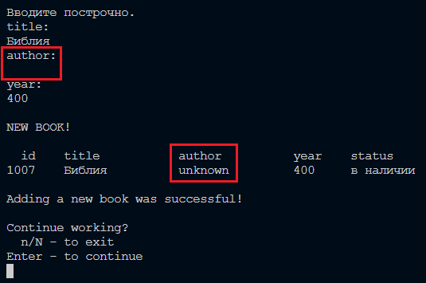 \
  Добавили в библиотеку Библию.

- ### f - find_book():

  Пропуская ввод названия, автора или года издания книги при поиске книг в библиотеке выводится весь каталог:

  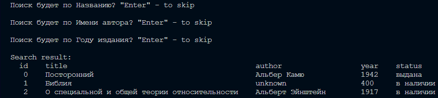 \
  Результат вывода команды `f` (find_book()).

  Можно вводить всё значения сразу или по отдельности:

  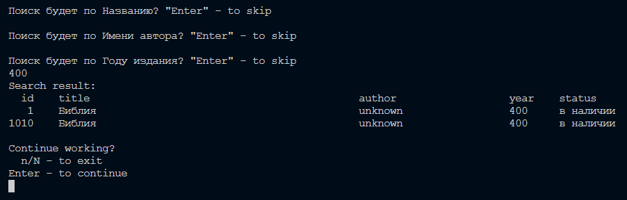 \
  Результат вывода команды `f` (find_book()) с `year` = 400.

  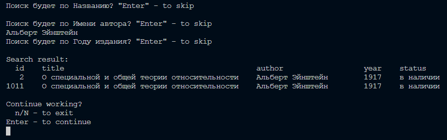 \
  Результат вывода команды `f` (find_book()) с `author` = 'Альберт Эйнштейн'.

  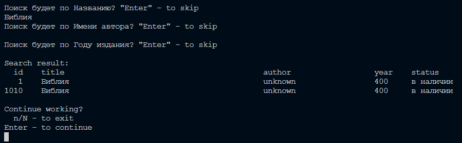 \
  Результат вывода команды `f` (find_book()) с `title` = 'Библия'.

  НО! Если невозможно вспомнить название или полное имя автора наверняка, достаточно ввести только то, что там точно есть, тогда проверка будет не на точное совпадение с результатом, а на наличие такое подстроки:

  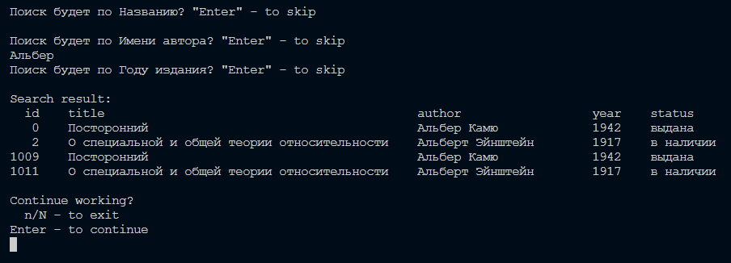 \
  Результат вывода команды `f` (find_book()) с `title` = 'Альбер'.

- ### c - change_book_status():

  Чтобы поменять статус книги с 'в наличии' на 'выдана' или наоборот, достаточно выбрать `c` в главном меню и ввести `id` нужной записи или `last`, чтобы изменить статус последней добавленной в список книги:

  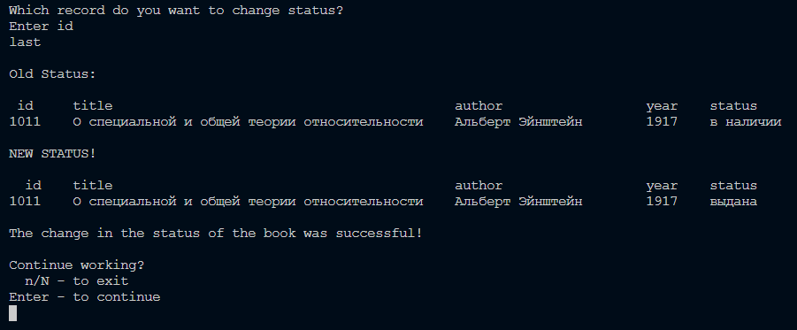 \
  Результат вывода команды `c` (change_book_status()) с `id` = '_last_'.

  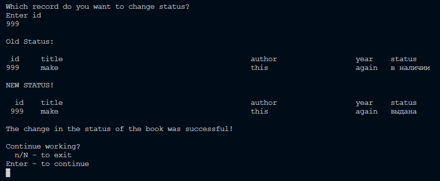 \
  Результат вывода команды `c` (change_book_status()) с `id` = '_999_'.

- ### d - delete_book():

  Чтобы удалить книгу из библиотеки, достаточно выбрать `d` в главном меню и ввести `id` нужной записи или `last`, чтобы удалить последнюю добавленную в список книгу:

  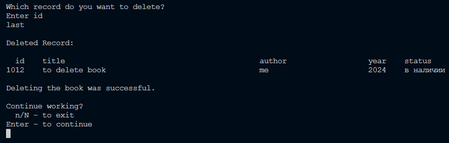 \
  Результат вывода команды `d` (delete_book()) с `id` = '_last_'.

  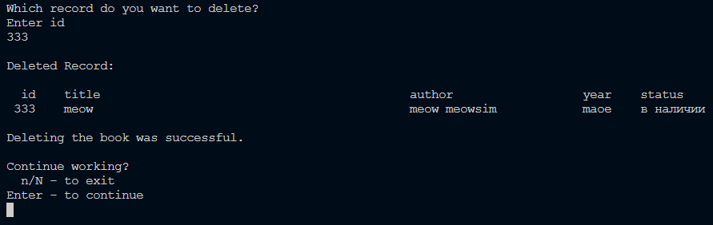 \
  Результат вывода команды `d` (delete_book()) с `id` = '_999_'.

- ### s - show_all():

  `s - show_all()` - не имеет никаких опций или особенностей использования. \
  Она выводит содержимое всей библиотеки:

   \
  Результат вывода команды `s` (show_all()).

## Прочее

Так как постоянно приходиться нажимать подтверждающий `Enter`, велика вероятность однажды нажать его лишний раз и выйти из программы или ввести неполные данные. \
Чтобы избежать подобных ситуаций, `Enter'у` задана команда продолжить работу, как в главном меню, так и во второстепенном: \
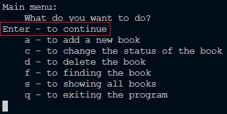 \
_Enter_ в главном меню. \
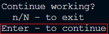 \
_Enter_ в дополнительном меню.

Основной код программы написан приложением с бесконечным циклов, `для выхода` из которого нужно ввести соответсвующие символы или слова:
- 'й', 'Й',
- 'q', 'Q', 'quit', 
- 'exit', 'make', 'clear',
- 'т', 'Т' (только для дополнительного меню),
- 'n', 'N' (только для дополнительного меню).